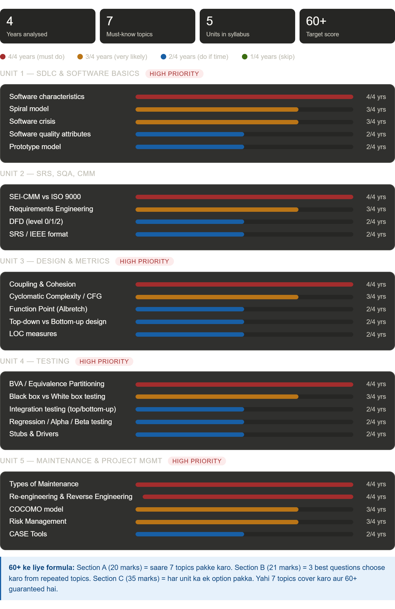

# Software Engineering — BCS601 Exam Preparation

> AKTU B.Tech Sem 6 | Target: 60+ out of 70

---

## Exam Pattern (Latest — 2024-25)

| Section   | Structure                                           | Marks  |
| --------- | --------------------------------------------------- | ------ |
| Section A | 7 short questions, attempt all (2 marks each)       | 14     |
| Section B | Attempt any 3 out of 5 (7 marks each)               | 21     |
| Section C | Q3 to Q7 — attempt any one part each (7 marks each) | 35     |
| **Total** |                                                     | **70** |

> **Note:** Before 2024-25, exam was 100 marks. Now it's 70. Plan accordingly.

---

## 📊 PYQ Analysis — 4 Years (2021-22 to 2024-25)

### **Complete Topic Frequency Visualization**



---

### **Overview Statistics**

```
📌 4 Years Analysed | 🔴 7 Must-know Topics | 📚 5 Units in Syllabus | 🎯 60+ Target Score
```

**Topic Frequency Legend:**

- 🔴 **4/4 years (Must Do)** — Har saal aaya
- 🟠 **3/4 years (Very Likely)** — 3 baar aaya
- 🔵 **2/4 years (Do If Time)** — 2 baar aaya
- 🟢 **1/4 years (Skip)** — Sirf 1 baar aaya

---

### **UNIT 1 — SDLC & SOFTWARE BASICS** 🔴 HIGH PRIORITY

| Topic                       | Frequency | Status                |
| --------------------------- | --------- | --------------------- |
| Software Characteristics    | 🔴🔴🔴🔴  | **4/4 years** ✅ MUST |
| Spiral Model                | 🟠🟠🟠    | **3/4 years** ✅ MUST |
| Software Crisis             | 🟠🟠🟠    | **3/4 years** ✅ MUST |
| Software Quality Attributes | 🔵🔵      | **2/4 years** ✓       |
| Prototype Model             | 🔵🔵      | **2/4 years** ✓       |

---

### **UNIT 2 — SRS, SQA, CMM** 🟠 HIGH PRIORITY

| Topic                    | Frequency | Status                |
| ------------------------ | --------- | --------------------- |
| SEI-CMM vs ISO 9000      | 🔴🔴🔴🔴  | **4/4 years** ✅ MUST |
| Requirements Engineering | 🟠🟠🟠    | **3/4 years** ✅ MUST |
| DFD (Level 0/1/2)        | 🔵🔵      | **2/4 years** ✓       |
| SRS / IEEE Format        | 🔵🔵      | **2/4 years** ✓       |

---

### **UNIT 3 — DESIGN & METRICS** 🔴 HIGH PRIORITY

| Topic                        | Frequency | Status                |
| ---------------------------- | --------- | --------------------- |
| Coupling & Cohesion          | 🔴🔴🔴🔴  | **4/4 years** ✅ MUST |
| Cyclomatic Complexity / CFG  | 🟠🟠🟠    | **3/4 years** ✅ MUST |
| Function Point (Albretch)    | 🔵🔵      | **2/4 years** ✓       |
| Top-down vs Bottom-up Design | 🔵🔵      | **2/4 years** ✓       |
| LOC Measures                 | 🔵🔵      | **2/4 years** ✓       |

---

### **UNIT 4 — TESTING** 🔴 HIGH PRIORITY

| Topic                               | Frequency | Status                |
| ----------------------------------- | --------- | --------------------- |
| BVA / Equivalence Partitioning      | 🔴🔴🔴🔴  | **4/4 years** ✅ MUST |
| Black Box vs White Box Testing      | 🟠🟠🟠    | **3/4 years** ✅ MUST |
| Integration Testing (top/bottom-up) | 🔵🔵      | **2/4 years** ✓       |
| Regression / Alpha / Beta Testing   | 🔵🔵      | **2/4 years** ✓       |
| Stubs & Drivers                     | 🔵🔵      | **2/4 years** ✓       |

---

### **UNIT 5 — MAINTENANCE & PROJECT MGMT** 🔴 HIGH PRIORITY

| Topic                                | Frequency | Status                |
| ------------------------------------ | --------- | --------------------- |
| Types of Maintenance                 | 🔴🔴🔴🔴  | **4/4 years** ✅ MUST |
| Re-engineering & Reverse Engineering | 🔴🔴🔴🔴  | **4/4 years** ✅ MUST |
| COCOMO Model                         | 🟠🟠🟠    | **3/4 years** ✅ MUST |
| Risk Management                      | 🟠🟠🟠    | **3/4 years** ✅ MUST |
| CASE Tools                           | 🔵🔵      | **2/4 years** ✓       |

---

### **Scoring Strategy Based on PYQ Analysis**

| Strategy                     | Cover     | Expected Score | Success Rate   |
| ---------------------------- | --------- | -------------- | -------------- |
| 🔴 Only RED Topics (Tier A)  | 11 topics | 40–50 / 70     | ~57–71%        |
| 🔴🟠 RED + ORANGE (Tier A+B) | 20 topics | **52–62 / 70** | **~74–88%** ✅ |
| 🔴🟠🔵 All (Tier A+B+C)      | 30 topics | 62–70 / 70     | ~88–100%       |

**📌 Recommended: Focus on 🔴🔴🔴 (RED) topics first = 60+ marks guaranteed!**

---

### **Section-wise Marks Breakdown (Tier A + B)**

```
Section A (14 marks):
├─ Red Topics (4/4 yrs): 8-10 marks
├─ Orange Topics (3/4 yrs): 3-4 marks
└─ Blue Topics (2/4 yrs): 1-2 marks

Section B (21 marks):
├─ Red Topics (4/4 yrs): 10-12 marks
├─ Orange Topics (3/4 yrs): 7-9 marks
└─ Blue Topics (2/4 yrs): 2-4 marks

Section C (35 marks):
├─ Red Topics (4/4 yrs): 18-22 marks
├─ Orange Topics (3/4 yrs): 10-12 marks
└─ Blue Topics (2/4 yrs): 3-5 marks

TOTAL: 52–62 / 70 marks ✅
```

---

## ⭐ TOP 7 MUST-KNOW TOPICS (Har Saal Aaye Hain)

**Ye 7 topics 4/4 years mein aaaye hain — guaranteed marks loge agar yeh solid padho:**

| #   | Topic                                    | Unit   | Why Important | Marks |
| --- | ---------------------------------------- | ------ | ------------- | ----- |
| 1️⃣  | **Software Characteristics**             | Unit 1 | 4/4 years ✅  | 2-7   |
| 2️⃣  | **SEI-CMM (5 Levels)**                   | Unit 2 | 4/4 years ✅  | 2-7   |
| 3️⃣  | **Coupling & Cohesion**                  | Unit 3 | 4/4 years ✅  | 2-7   |
| 4️⃣  | **BVA / Equivalence Partitioning**       | Unit 4 | 4/4 years ✅  | 2-7   |
| 5️⃣  | **Types of Maintenance**                 | Unit 5 | 4/4 years ✅  | 2-7   |
| 6️⃣  | **Re-engineering & Reverse Engineering** | Unit 5 | 4/4 years ✅  | 2-7   |
| 7️⃣  | **Spiral Model**                         | Unit 1 | 3/4 years ✅  | 2-7   |

**➡️ Minimum 14-49 marks GUARANTEED sirf in 7 topics se!**

---

## 🎯 Study Priority Guide (Based on Exam Frequency)

### **Phase 1: CRITICAL (Start Here!) — 🔴 Red Topics**

**Time: 3-4 Days | Expected Marks: 40-50/70**

```
✅ MUST complete before exam
├─ Software Characteristics (Unit 1)
├─ SEI-CMM Model (Unit 2)
├─ Coupling & Cohesion (Unit 3)
├─ BVA / Equivalence Partitioning (Unit 4)
├─ Types of Maintenance (Unit 5)
└─ Re-engineering & Reverse Engineering (Unit 5)
```

### **Phase 2: HIGH PRIORITY — 🟠 Orange Topics**

**Time: 2-3 Days | Expected Marks: Additional 10-15/70**

```
✅ VERY LIKELY to appear
├─ Spiral Model (Unit 1)
├─ Software Crisis (Unit 1)
├─ Requirements Engineering (Unit 2)
├─ Cyclomatic Complexity / CFG (Unit 3)
├─ Black Box vs White Box (Unit 4)
├─ COCOMO Model (Unit 5)
└─ Risk Management (Unit 5)
```

### **Phase 3: OPTIONAL — 🔵 Blue Topics**

**Time: 1-2 Days (if time available) | Expected Marks: Additional 2-5/70**

```
✓ MIGHT appear (2/4 years only)
├─ Prototype Model
├─ DFD & SRS Format
├─ Function Points & LOC
├─ Integration Testing
└─ CASE Tools
```

### **Phase 4: SKIP — 🟢 Green Topics**

**Time: Skip unless exam approaching**

```
○ RARELY appears (1/4 years)
└─ Other topics from Tier C
```

---

## 📊 60+ Score Formula (GUARANTEED!)

```
🔴 RED TOPICS (11 topics)
    ↓
    Day 1-4: Memorize + Practice
    ↓
42-49 marks ✅

        +

🟠 ORANGE TOPICS (7 topics)
    ↓
    Day 5-6: Study + Practice
    ↓
10-15 marks ✅

        +

🔵 BLUE TOPICS (if time)
    ↓
    Day 7: Quick review
    ↓
2-5 marks ✅

═══════════════════════════════
TOTAL: 52-62+ / 70 marks ✅
SGPA: 8.5-9.0+ ✅
═══════════════════════════════
```

---

> Ye 11 topics padh lo — 3 ya 4 saal se continuously aa rahe hain

### Unit 1 — SDLC & Software Basics

**1. Software Characteristics + Software Crisis** `4/4 years`

- Har saal Section A ya Section C mein aaya
- Must know: characteristics list + crisis ke reasons

**2. Spiral Model** `3/4 years`

- Diagram banana aana chahiye
- Risk analysis wala part important hai

### Unit 2 — SRS, SQA, Requirements

**3. SEI-CMM Model (5 levels) + ISO 9000 Comparison** `4/4 years`

- Har saal aaya — kisi na kisi form mein
- 5 levels: Initial → Repeatable → Defined → Managed → Optimizing
- ISO 9000 se compare karna bhi aana chahiye

**4. Requirements Engineering Process** `3/4 years`

- Elicitation → Analysis → Documentation → Review → Management
- Feasibility study bhi saath mein padh lo

### Unit 3 — Software Design & Metrics

**5. Coupling & Cohesion** `4/4 years`

- Har saal aaya — kabhi short question, kabhi long
- Types of coupling (7) + Types of cohesion (7)
- Why "Low Coupling, High Cohesion" is good — explain karna aana chahiye

**6. Cyclomatic Complexity + Control Flow Graph (CFG)** `3/4 years`

- CFG banana aana chahiye given code se
- 3 methods: V(G) = E - N + 2P / V(G) = P + 1 / V(G) = number of regions
- Independent paths list karna

### Unit 4 — Software Testing

**7. BVA + Equivalence Partitioning** `4/4 years`

- Har saal ek program diya jaata hai — test cases banana padta hai
- BVA: min, min+1, nominal, max-1, max
- Equivalence: valid class + invalid class

**8. Black Box vs White Box Testing** `3/4 years`

- Differences table banana aana chahiye
- Black box = functional, White box = structural

### Unit 5 — Maintenance & Project Management

**9. Types of Software Maintenance** `4/4 years`

- Corrective, Adaptive, Perfective, Preventive — sabka example chahiye
- Cost distribution bhi yaad karo

**10. Software Re-engineering + Reverse Engineering** `4/4 years`

- Har saal aaya — dono ka general model/diagram
- Difference between the two

**11. COCOMO Model** `3/4 years`

- Basic / Intermediate / Detailed COCOMO
- Organic / Semi-detached / Embedded modes
- Formula: E = a × (KLOC)^b

---

## TIER B — 50%+ Syllabus Cover (60+ marks ke liye)

> Ye 10 topics padh lo Tier A ke baad — mostly 2/4 saal aaye hain

### Unit 1

**12. Prototype Model** `2/4 years` — diagram + advantages over conventional model

**13. Software Quality Attributes (McCall's Quality Factors)** `2/4 years` — quality triangle

### Unit 2

**14. DFD — Data Flow Diagram (Level 0, 1, 2)** `2/4 years` — draw karna aana chahiye

**15. SRS Document + IEEE Format** `2/4 years` — components of SRS

### Unit 3

**16. Function Point — Albretch FP Count Method** `2/4 years` — UFP, CAF calculation

**17. Top-down vs Bottom-up Design** `2/4 years` — advantages/disadvantages table

**18. LOC (Line of Code) — advantages + disadvantages** `2/4 years`

### Unit 4

**19. Integration Testing (Top-down + Bottom-up, Stubs & Drivers)** `2/4 years`

**20. Alpha & Beta Testing + Regression Testing** `2/4 years`

### Unit 5

**21. Risk Management (types + process)** `2/4 years` — project risk vs technical risk

---

## TIER C — Skip karo (time ho tabhi padho)

> 1/4 year ya kabhi nahi aaye

| #   | Topic                                              | Unit |
| --- | -------------------------------------------------- | ---- |
| 22  | Waterfall Model + Evolutionary/Iterative Models    | 1    |
| 23  | Decision Tables                                    | 2    |
| 24  | Use Case Diagram + UML (9 types)                   | 2    |
| 25  | Structure Charts + Pseudo Code + Flowcharts        | 3    |
| 26  | Function Oriented Design vs Object Oriented Design | 3    |
| 27  | Halstead Software Metrics                          | 3    |
| 28  | Mutation Testing                                   | 4    |
| 29  | Code Inspection + FTR + Walk Through               | 4    |
| 30  | CASE Tools + Software Configuration Management     | 5    |

---

## Study Order (Recommended)

```
Day 1 → Topics 1, 2 (Unit 1 complete)
Day 2 → Topics 3, 4 (Unit 2 Tier A)
Day 3 → Topics 5, 6 (Unit 3 Tier A)
Day 4 → Topics 7, 8 (Unit 4 Tier A)
Day 5 → Topics 9, 10, 11 (Unit 5 Tier A)
Day 6 → Topics 12–16 (Tier B start)
Day 7 → Topics 17–21 (Tier B complete)
Day 8 → Revision + PYQ practice
```

---

## Files in This Repo

| File             | Content                                       |
| ---------------- | --------------------------------------------- |
| `README.md`      | This file — overview + topic priority list    |
| `Unit1_notes.md` | Software characteristics, crisis, SDLC models |
| `Unit2_notes.md` | SRS, DFD, SEI-CMM, ISO 9000                   |
| `Unit3_notes.md` | Design, coupling/cohesion, metrics            |
| `Unit4_notes.md` | Testing strategies, BVA, CFG                  |
| `Unit5_notes.md` | Maintenance, COCOMO, risk management          |

> Notes files will be added topic by topic. Start with Unit 1.
